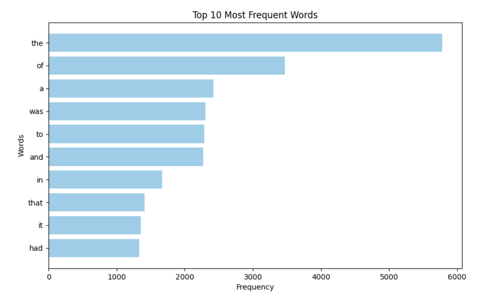
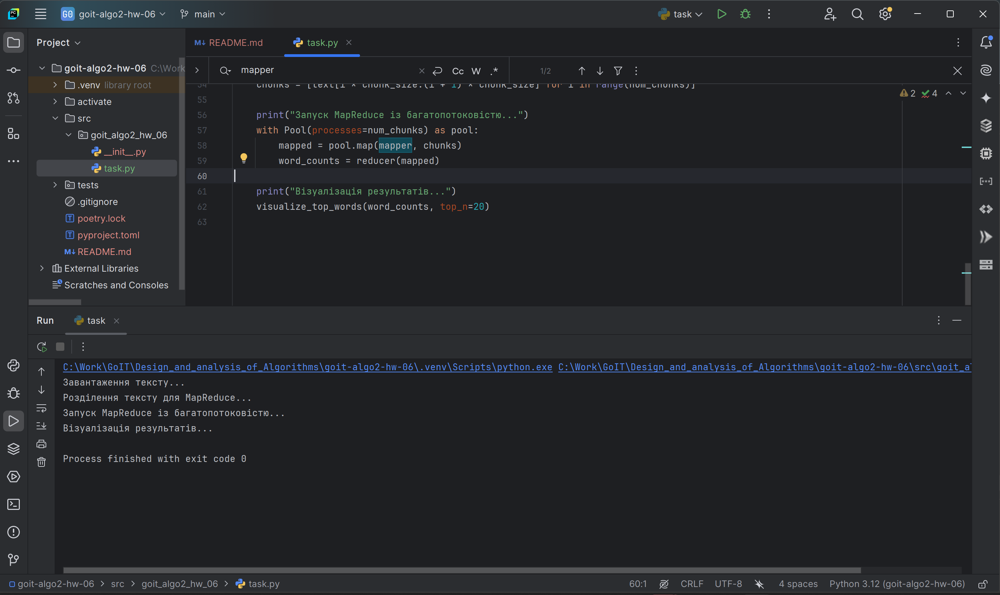
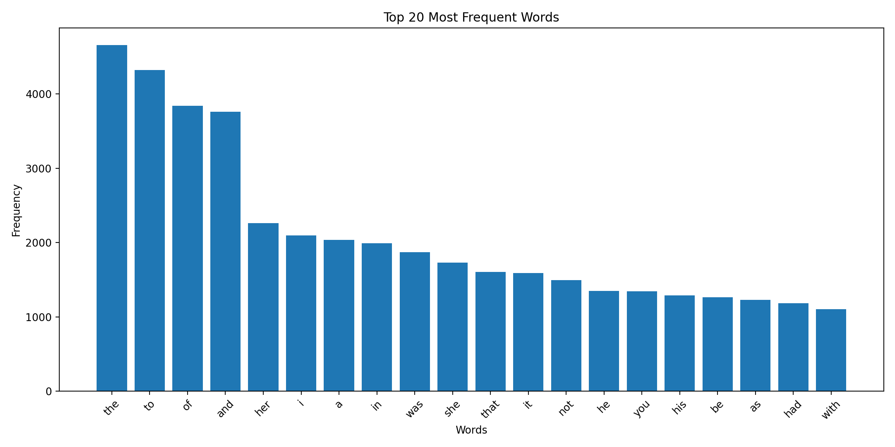

## Завдання

Напишіть Python-скрипт, який завантажує текст із заданої URL-адреси, аналізує
частоту використання слів у тексті за допомогою парадигми MapReduce і візуалізує
топ-слова з найвищою частотою використання у тексті.

### Покрокова інструкція

1. Імпортуйте необхідні модулі (`matplotlib` та інші).

2. Візьміть код реалізації MapReduce з конспекту.

3. Створіть функцію `visualize_top_words` для візуалізації результатів.

4. У головному блоці коду отримайте текст за URL, застосуйте MapReduce та
   візуалізуйте результати.

👉🏼 Наприклад, для топ 10 найчастіше вживаних слів побудова графіка може
виглядати так:

### Критерії прийняття

📌Критерії прийняття домашнього завдання є обов’язковою умовою розгляду завдання
ментором. Якщо якийсь з критеріїв не виконано, ДЗ відправляється ментором на
доопрацювання без оцінювання. Якщо вам «тільки уточнити»😉 або ви
«застопорилися» на якомусь з етапів виконання — звертайтеся до ментора у Slack).

1. Код успішно завантажує текст із заданої URL-адреси.

2. Код коректно виконує аналіз частоти слів із використанням MapReduce.

3. Візуалізація відображає топ-слова за частотою використання.

4. Код ефективно використовує багатопотоковість.

5. Код читабельний та відповідає стандартам PEP 8.

### Результат виконаного ДЗ

